<div align="center">
  

  <br/><br/>

  # ✦ Hello Traveler, I'm Joshua (Swashua) ✦
  
  <p>
    <em>"Somewhere, something incredible is waiting to be known." — Carl Sagan</em>
  </p>

  <p>
    <a href="#-about-me">About</a> •
    <a href="#-tech-stack--celestial-tools">Tech Stack</a> •
    <a href="#-real-sky-chart">Constellations</a> •
    <a href="#-stargazing-telemetry">Telemetry</a>
  </p>

  ---
</div>

## 🌌 About Me

```astronomy
Constellation Map: [ Ursa Major • Cassiopeia • Cygnus • Orion ]
Current Coordinates: Orbiting Full-Stack & Systems Development
Primary Mission: Building resilient applications with clean architectures
```

- 🔭 **Observing & Building:** Scalable web platforms, microservices, and interactive applications.
- 🪐 **Cosmic Exploration:** Clean code, modern UI/UX design, cloud systems, and AI tooling.
- ⚡ **Fun Fact:** The stars in the banner above represent exact astronomical alignments (Ursa Major, Cassiopeia, Cygnus, and Orion with Betelgeuse & Rigel).

---

## 🛰️ Tech Stack & Celestial Tools

<div align="center">
  
</div>

<br/>

| Domain | Constellation Orbit |
| :--- | :--- |
| **Frontend & UI** | TypeScript, React, Next.js, Tailwind CSS, HTML5, CSS3 |
| **Backend & APIs** | Node.js, Python, .NET / C#, REST, GraphQL |
| **DevOps & Cloud** | Git, Docker, Linux, CI/CD Actions |

---

## 🔭 Stargazing Telemetry

<div align="center">
  <a href="https://github.com/Swashua">
    
    
  </a>
</div>

<br/>

<div align="center">
  <a href="https://github.com/Swashua">
    
  </a>
</div>

---

<div align="center">
  <sub>✨ Designed with real night sky constellations: <b>Ursa Major</b> (Big Dipper), <b>Cassiopeia</b>, <b>Cygnus</b> (Northern Cross), and <b>Orion</b> (with Betelgeuse & Rigel). ✨</sub>
</div>
