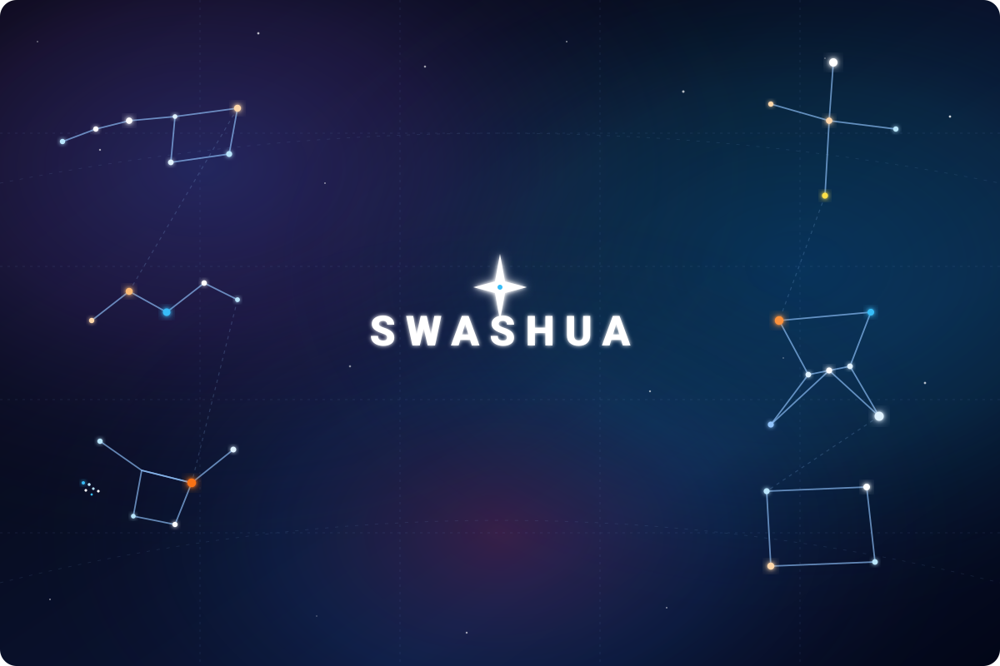

  <!-- Panoramic Full-Page Real Constellation Sky Map -->
  

    

  <!-- Interactive Skill Icons Floating Under Constellations -->
  <h3>🌌 Celestial Tooling &amp; Stack</h3>
  

    

  <!-- Stargazing Telemetry Cards with Matching Deep Space Midnight Background -->
  <h3>🔭 Stargazing GitHub Telemetry</h3>
  
    
  

    

  ---
  ✨ Constellations Featured: <b>Ursa Major</b>, <b>Cassiopeia</b>, <b>Taurus &amp; Pleiades</b>, <b>Cygnus</b>, <b>Orion (Betelgeuse &amp; Rigel)</b>, and <b>Pegasus</b>. ✨

